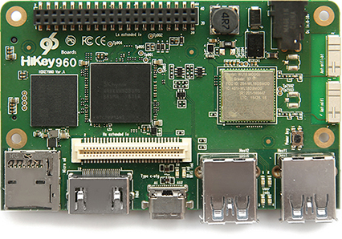
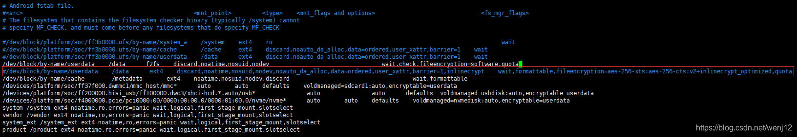
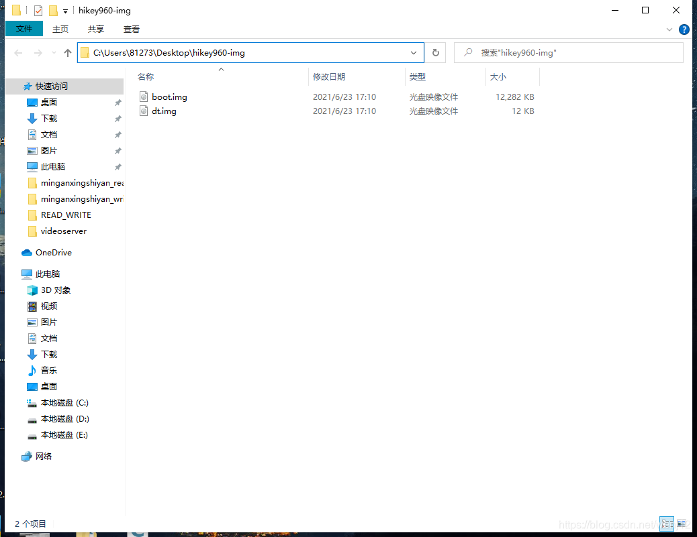

HiKey960 开发板是 Google Android 官方提供支持的开发板。Google 有提供为这块开发板编译内核的文档，地址为 `https://source.android.com/source/devices#960hikey` ，描述了 HiKey960 开发板编译内核的方法。

HiKey960 有 3GB RAM 的配置，HiKey960 板子如下图：



# 1.准备工作

## 1.下载安装NDK

交叉编译工具Android NDK  `https://developer.android.com/ndk/downloads/index.html` 
安装 `https://www.jianshu.com/p/abdad7fd1367`

## 2.下载安装gcc-aarch64-linux-gnu

```bash
sudo apt install gcc-aarch64-linux-gnu
```

## 3.下载aosp和hikey-linaro的源码

**从清华的镜像下载aosp**
参考 `https://mirrors.tuna.tsinghua.edu.cn/help/AOSP/`
**过程摘录**
下载 repo 工具:
**需要python2.7环境**
```bash
mkdir ~/bin
PATH=~/bin:$PATH
curl https://storage.googleapis.com/git-repo-downloads/repo > ~/bin/repo
chmod a+x ~/bin/repo
```
**使用每月更新的初始化包**
由于首次同步需要下载约 95GB 数据，过程中任何网络故障都可能造成同步失败，我们强烈建议您使用初始化包进行初始化。(*这一步可以现在本地电脑上用迅雷高速下载后，拉到服务器上然后从第二行进行*)
```bash
wget -c https://mirrors.tuna.tsinghua.edu.cn/aosp-monthly/aosp-latest.tar # 下载初始化包
tar xf aosp-latest.tar
cd AOSP   # 解压得到的 AOSP 工程目录
# 这时 ls 的话什么也看不到，因为只有一个隐藏的 .repo 目录
repo sync # 正常同步一遍即可得到完整目录
# 或 repo sync -l 仅checkout代码
```

**下载hikey-linaro镜像**`https://android.googlesource.com/kernel/hikey-linaro/+/refs/heads/android-hikey-linaro-4.19`
**下载HDMI二进制文件**
这里下载的HDMI二进制文件解压后，需要放在和aosp同一个目录下
```bash
Download and extract HDMI binaries:
$ wget https://dl.google.com/dl/android/aosp/arm-hikey960-OPR-cf4e0c80.tgz
$ tar xzf arm-hikey960-OPR-cf4e0c80.tgz
$ ./extract-arm-hikey960.sh
```
或者最新版：`https://developers.google.com/android/drivers`

# 2.编译aosp源码(机器地址192.168.1.75)

```bash
cd /home/tan/960_all/aosp
. ./build/envsetup.sh //注意2个点之间有空格
lunch hikey960-userdebug//选择的是userdebug模式，可惜我们现在都没有编译成功engineer模式。
make TARGET_KERNEL_USE=4.19 -j32 //一定要选你要编译的内核版本。编译时间2h-4h不等，编译一遍后再编译会快一些
```
**NOTE:**
**1.一定要选你要编译的内核版本
2.不要用su来执行（因此最好不要将工作目录放在home/user之外）
3.如果出现问题，可以执行make clobber来清理**


# 3.编译Hikey-linaro源码
下载完hikey-linaro的压缩包后创建文件夹hikey-linaro-4.19后解压到里面
```bash
cd /home/tan/960_all/hikey-linaro-4.19
```
根据自己的路径配置NDK环境(可能不需要)：

```bash
export NDK=/home/tan/960_all/android-ndk-r16b
export AARCH=/home/tan/960_all/android-ndk-r16b/toolchains/aarch64-linux-android-4.9/prebuilt/linux-x86_64/bin
export PATH=$AARCH:$NDK:$PATH
或者
export NDK=/home/tan/Android_NDK/android-ndk-r16b
export AARCH=/home/tan/Android_NDK/android-ndk-r16b/toolchains/aarch64-linux-android-4.9/prebuilt/linux-x86_64/bin
export PATH=$AARCH:$NDK:$PATH
```

```bash
make ARCH=arm64 hikey960_defconfig
```
 设置配置，在第一次编译时做过后.config生成，之后再做时 可以不用做这句话。 踩雷2：这句话是生成.config文件，之后在adb shell里mount f2fs时报错无法挂载 ，因为transport endpoint等等的坑要在这里填。 是因为没有配置F2FS的编译configuration。

```bash
vim arch/arm64/configs/hikey960_defconfig
```

添加如下内容：

```bash
CONFIG_F2FS_FS=y 
CONFIG_F2FS_STAT_FS=y 
CONFIG_F2FS_FS_ATTR=y 
CONFIG_F2FS_POSIX_ACL=y 
CONFIG_F2FS_FS_SECURITY=y 
CONFIG_F2FS_CHECK_FS=y 
CONFIG_F2FS_IO_TRACE=y 
CONFIG_F2FS_FS_ENCRYPTION=y 
CONFIG_DEBUG_FS=y
```
使上面添加的配置生效：
```bash
make ARCH=arm64 hikey960_defconfig
```

```bash
#查看相关配置是否选上：
make menuconfig
```

编译：
```bash
make ARCH=arm64 CROSS_COMPILE=aarch64-linux-gnu- -j64
```

# 4.在/data下挂载F2FS

## 1.把整个/data分区24G都格式化为f2fs

```bash
cd /home/tan/960_all/aosp/device/linaro/hikey/hikey960
```

```bash
vim fstab.hikey960
#注释掉 /data分区的ext4选项：
#/dev/block/by-name/userdata    /data      ext4    discard,noatime,nosuid,nodev,noauto_da_alloc,data=ordered,user_xattr,barrier=1,inlinecrypt    wait,formattable,fileencryption=aes-256-xts:aes-256-cts:v2+inlinecrypt_optimized,quota
```



```bash
vim BoardConfig.mk
#在末尾添加：
TARGET_USERIMAGES_USE_F2FS := true
BOARD_USERDATAIMAGE_FILE_SYSTEM_TYPE := f2fs
```

```bash
cd /home/tan/960_all/aosp/device/linaro/hikey
vim BoardConfigCommon.mk
#在ext4附近添加：
TARGET_USERIMAGES_USE_F2FS := true
```

## 2.重新编译AOSP
**复制hikey-linaro生成的镜像到AOSP中**
```bash
cp /home/tan/960_all/hikey-linaro-4.19/arch/arm64/boot/dts/hisilicon/hi3660-hikey960.dtb /home/tan/960_all/aosp/device/linaro/hikey-kernel/hikey960/4.19
cp /home/tan/960_all/hikey-linaro-4.19/arch/arm64/boot/Image.gz /home/tan/960_all/aosp/device/linaro/hikey-kernel/hikey960/4.19
cp /home/tan/960_all/hikey-linaro-4.19/arch/arm64/boot/Image.gz-dtb /home/tan/960_all/aosp/device/linaro/hikey-kernel/hikey960/4.19
```
**重新编译**
```bash
cd /home/tan/960_all/aosp
make BOARD_USERDATAIMAGE_FILE_SYSTEM_TYPE=f2fs TARGET_USERIMAGES_USE_F2FS=true TARGET_KERNEL_USE=4.19 -j64
```
# 5.刷整套镜像
将1和3开关置位开启进入fastboot模式

```bash
cd /home/tan/960_all/aosp/device/linaro/hikey/installer/hikey960
./flash-all.sh
```

刷完后 关闭3号开关重新通电来开机
待蓝色灯闪起则开机成功

# 6.修改内核后刷板子
**以后修改内核源码后可以直接从这一步开始做，而不必再做之前的工作**

例如文件系统内核源码位置：`/home/tan/960_all/hikey-linaro-4.19/fs/`

修改内核源码后重新编译hikey-linaro-4.19内核源码：
```bash
cd /home/tan/960_all/hikey-linaro-4.19
make ARCH=arm64 CROSS_COMPILE=aarch64-linux-gnu- -j64
```

# 7.复制hikey-linaro生成的镜像到AOSP中

按照官方文档中所说的那样复制hikey960.dtb和Image.gz到指定目录生成boot.img。在192.168.1.75上的相关语句如下：
```bash
cp /home/tan/960_all/hikey-linaro-4.19/arch/arm64/boot/dts/hisilicon/hi3660-hikey960.dtb /home/tan/960_all/aosp/device/linaro/hikey-kernel/hikey960/4.19
cp /home/tan/960_all/hikey-linaro-4.19/arch/arm64/boot/Image.gz /home/tan/960_all/aosp/device/linaro/hikey-kernel/hikey960/4.19
cp /home/tan/960_all/hikey-linaro-4.19/arch/arm64/boot/Image.gz-dtb /home/tan/960_all/aosp/device/linaro/hikey-kernel/hikey960/4.19
```

# 8.重新生成boot.img和dt.img

```bash
cd /home/tan/960_all/aosp
make bootimage BOARD_USERDATAIMAGE_FILE_SYSTEM_TYPE=f2fs TARGET_USERIMAGES_USE_F2FS=true TARGET_KERNEL_USE=4.19 -j64
make bootimage out/target/product/hikey960/dt.img BOARD_USERDATAIMAGE_FILE_SYSTEM_TYPE=f2fs TARGET_USERIMAGES_USE_F2FS=true TARGET_KERNEL_USE=4.19 -j64
```

# 9.重新刷镜像
由于我们只是修改文件系统的源码，因此只需要重新刷两个镜像即可，前提是已经做了第5步。
在本地主机上建立一个文件夹例如：`C:\Users\81273\Desktop\hikey960-img`

将服务器上的两个镜像boot.img和dt.img拉到本地，位置为：
```bash
cd /home/tan/960_all/aosp/out/target/product/hikey960/
```
将1和3开关置位开启进入fastboot模式
打开Windows powershell：

```bash
fastboot reboot
fastboot flash boot C:/Users/81273/Desktop/hikey960-img/boot.img
fastboot flash dts C:/Users/81273/Desktop/hikey960-img/dt.img
```
刷写成功后关闭3号开关，重新通电，待蓝色灯亮起即为开机。
